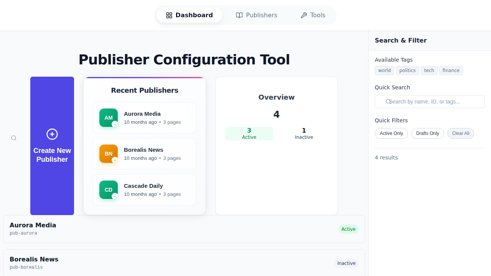

# Complete System User Guide
## Publisher Configuration Tool

**Version:** 1.0  
**Last Updated:** November 23, 2025  
**For:** Taboola Support Engineers

---

## 📚 Table of Contents - Quick Navigation

**Click any section to jump directly to it:**

### 🚀 Getting Started
- [Installation (5 Steps)](#-installation-5-steps) - Get up and running in 10 minutes
- [First Time Opening](#first-time-opening) - What you'll see

### 📊 PART 1: Dashboard Page
- [Dashboard Overview](#-part-1-dashboard-page) - Your command center
- [Navigation Bar](#1-navigation-bar) - Switching between pages
- [Create New Publisher](#2-create-new-publisher-button) - Start creating
- [Recent Publishers](#3-recent-publishers-card) - Quick access to your work
- [Overview Stats](#4-overview-stats-card) - System at a glance
- [Publisher Cards](#5-publisher-cards-grid) - Browse all publishers
- [Search & Filter](#6-search--filter-sidebar) - Find what you need
- [Dashboard Videos](#-dashboard-video-demonstrations) - 3 demonstration scripts

### 📝 PART 2: Publishers Page
- [Publishers Overview](#-part-2-publishers-page) - Edit configurations
- [Publishers Sidebar](#publishers-sidebar) - List of all publishers
- [Details Panel](#publisher-details-panel) - View and edit
- [Creating New](#creating-a-new-publisher) - Step-by-step guide
- [Editing Existing](#editing-a-publisher) - Making changes
- [Publishers Videos](#-publishers-video-demonstrations) - 2 demonstration scripts

### 📖 Reference & Help
- [Status System](#-status-system-reference) - Active/Inactive/Draft explained
- [Quick Reference](#-quick-reference-tables) - Common tasks at a glance
- [Troubleshooting](#-troubleshooting-guide) - Fix common problems
- [Best Practices](#-best-practices) - Work efficiently

---

## 🚀 Installation (5 Steps)

### Prerequisites Checklist
- ✅ **Node.js 18+** - [Download here](https://nodejs.org/)
- ✅ **Git** - [Download here](https://git-scm.com/)
- ❌ **NO credentials needed**
- ❌ **NO database required**

### Installation Steps

```bash
# Step 1: Clone the repository
git clone https://github.com/TzoharLary/deeper-dive-interview-test.git

# Step 2: Navigate into the folder
cd deeper-dive-interview-test

# Step 3: Install dependencies
npm install

# Step 4: Start the application
npm run dev

# Step 5: Open your browser
# Go to: http://localhost:3000
```

⏱️ **Total Time:** 10 minutes

---

## First Time Opening

When you open **http://localhost:3000** for the first time:



**You'll see three tabs:**
1. **📊 Dashboard** - Overview of all publishers (default view)
2. **📝 Publishers** - View and edit individual publishers  
3. **🔧 Tools** - Additional tools (coming soon)

**Where to start:** The Dashboard! It gives you the big picture.

---

# 📊 PART 1: DASHBOARD PAGE

## Dashboard Overview

**What is it?** Your central hub for managing publishers. See everything at a glance.

**When to use:**
- 🔍 Starting your work session
- 🔎 Searching for a specific publisher
- 📈 Checking system status
- ⚡ Quick access to recent work

**Layout:**
```
┌─────────────────────────────────────────────────────┐
│  Navigation: Dashboard | Publishers | Tools          │
├──────────────┬──────────────────┬───────────────────┤
│              │  Recent          │  Overview         │
│  Create New  │  Publishers      │  Stats            │
│  [+ Button]  │  (3 most recent) │  Total/Active/... │
│              │                  │                   │
├──────────────┴──────────────────┴──────────────────┬┤
│  Publisher Cards Grid                               ││
│  ┌─────┐ ┌─────┐ ┌─────┐                           ││
│  │Card │ │Card │ │Card │                           ││
│  └─────┘ └─────┘ └─────┘                           ││
│                                                     ││
│                                            Search & ││
│                                            Filter   ││
│                                            Sidebar  ││
└─────────────────────────────────────────────────────┘
```

---

## 1. Navigation Bar

**Location:** Top of every page (fixed position)

**Three tabs with icons:**
- **Dashboard** 📊 (grid icon) - Overview page
- **Publishers** 📝 (book icon) - Edit page
- **Tools** 🔧 (wrench icon) - Coming soon

**Active tab:** Darker text + bold font

**How to use:** Click any tab to switch pages

---

## 2. Create New Publisher Button

**Location:** Left side of Dashboard

**Appearance:**
- Large purple/indigo button
- **+** icon in circle
- Text: "Create New Publisher"

**What it does:**
- Opens Publishers page
- Shows empty form
- Ready to create new configuration

**When to click:**
- Adding a new publisher to system
- Starting fresh configuration

---

## 3. Recent Publishers Card

**Location:** Center of Dashboard

**Shows:** Your 3 most recently edited publishers

**Each entry displays:**
- 🎨 **Colored avatar** with initials (e.g., "AM" for Aurora Media)
- ✅ **Status icon** (✓ = Active, ● = Inactive)
- 📝 **Publisher name** (large text)
- ⏰ **Last updated** (e.g., "10 months ago")
- 📄 **Page count** (e.g., "3 pages")

**How to use:**
1. Scan the 3 recent items
2. Click on any row
3. Opens that publisher in Publishers page

**Sorting:** Most recently updated appears first

---

## 4. Overview Stats Card

**Location:** Right side of Dashboard

**Displays:**
- **Total:** Large number (e.g., "4 Publishers")
- **Active:** Green box with count (in use)
- **Inactive:** Gray box with count (not in use)

**📊 Example:**
```
Overview
4 Publishers

┌─────────┬─────────┐
│ Active  │Inactive │
│   3     │   1     │
│ (green) │ (gray)  │
└─────────┴─────────┘
```

**Dynamic:** Numbers update when you apply filters

**Note:** Draft publishers counted in Total, not shown separately here

---

## 5. Publisher Cards Grid

**Location:** Main content area

**Layout:**
- Responsive grid
- 2-3 columns depending on screen size
- Even spacing between cards

**Each card shows:**

### Top Section
- **Publisher Name** (bold, large) - e.g., "Aurora Media"
- **Publisher ID** (small, gray) - e.g., "pub-aurora"

### Status Badge (Top-Right)
- 🟢 **Green "Active"** - Complete + in use
- ⚪ **Gray "Inactive"** - Complete + not in use  
- 🟡 **Amber "Draft"** - Incomplete

### Interactions
- **Hover:** Shadow appears, name turns blue
- **Click:** Opens publisher in Publishers page
- **Cursor:** Pointer icon on hover

---

## 6. Search & Filter Sidebar

**Location:** Right side of Dashboard

**Purpose:** Find publishers quickly using multiple methods

### 6A. Available Tags

**Top of sidebar**

**Shows:** Clickable tag chips (world, politics, tech, finance, etc.)

**How to use:**
1. Click any tag chip
2. Search field auto-fills with that tag
3. Publishers with that tag appear

---

### 6B. Quick Search Field

**Below tags section**

**Searches across:**
- Publisher names
- Publisher IDs
- Tags

**Features:**
- ⚡ Real-time filtering (as you type)
- 🔤 Case-insensitive
- 🎯 Partial matches work

**Examples:**
- Type "aurora" → Finds "Aurora Media"
- Type "pub-" → Shows all with "pub-" prefix
- Type "tech" → Shows all with tech tag

---

### 6C. Quick Filters

**Three buttons:**

**Active Only** 
- Click to show only Active publishers
- Button turns blue when active
- Excludes Inactive and Draft

**Drafts Only**
- Click to show only Draft publishers
- Button turns amber when active
- Excludes Active and Inactive

**Clear All**
- Click to remove all filters
- Clears search field
- Shows all publishers

**Note:** Active Only and Drafts Only are mutually exclusive

---

### 6D. Results Count

**Bottom of sidebar**

**Format:** "X results" (e.g., "4 results", "1 result")

**Updates when you:**
- Type in search
- Click a tag
- Apply a filter

**Purpose:** See how many publishers match your criteria

---

## 🎬 Dashboard Video Demonstrations

### Video 1: Dashboard Walkthrough (3:00)

**Topics covered:**
- Navigation between pages
- Create New Publisher button
- Recent Publishers card
- Overview Stats
- Publisher Cards grid
- Search & Filter sidebar

**Script with timestamps:**
```
[00:00-00:15] Opening
"This is the Dashboard - your overview of all publishers."

[00:15-00:45] Navigation
"Three tabs at top: Dashboard (current), Publishers, Tools."

[00:45-01:15] Quick Actions
"Left: Create button. Center: Recent 3. Right: Stats."

[01:15-02:00] Publisher Cards
"Each card shows name, ID, and colored status badge."

[02:00-02:30] Search & Filter
"Right sidebar: search in real-time, click tags, use filters."

[02:30-03:00] Closing
"Click any card to open that publisher for editing."
```

---

### Video 2: Dashboard Tasks (2:30)

**6 common tasks demonstrated:**

**[0:00-0:30] Task 1: Find Publisher**
1. Type "aurora" in search
2. Grid filters instantly
3. Click the card

**[0:30-1:00] Task 2: Show Active Only**
1. Click "Active Only"
2. Grid shows only active
3. Click "Clear All"

**[1:00-1:20] Task 3: Search by Tag**
1. Click "tech" tag chip
2. Search auto-fills
3. Tagged publishers appear

**[1:20-1:40] Task 4: Create New**
1. Click "Create New Publisher"
2. Redirects to Publishers page

**[1:40-2:00] Task 5: Open Recent**
1. Find in Recent Publishers card
2. Click that row
3. Opens in Publishers page

**[2:00-2:30] Task 6: Combine Filters**
1. Click "Active Only"
2. Type "media"
3. Shows active publishers with "media"
4. Click "Clear All"

---

# 📝 PART 2: PUBLISHERS PAGE

## Publishers Page Overview

**What is it?** The editing workspace where you view and modify publisher configurations.

**When to use:**
- 📝 Creating a new publisher
- ✏️ Editing existing publisher
- 👀 Viewing full configuration details
- 🔧 Adding/removing page configurations

**Layout:**
```
┌────────────────────────────────────────────────────┐
│  Navigation: Dashboard | Publishers | Tools         │
├───────────────┬────────────────────────────────────┤
│ SIDEBAR       │ DETAILS PANEL                      │
│               │                                    │
│ [Search...]   │ (Selected Publisher or Empty)      │
│               │                                    │
│ ☰ Publisher 1 │ Form fields:                       │
│ ☰ Publisher 2 │ - General Info                     │
│ ☰ Publisher 3 │ - Dashboard URLs                   │
│ ☰ Publisher 4 │ - Page Configurations              │
│               │ - Optional Fields                  │
│ [Upload]      │                                    │
│ [Create New]  │ [Save] [Cancel]                    │
└───────────────┴────────────────────────────────────┘
```

---

## Publishers Sidebar

**Location:** Left panel (takes ~25% of screen width)

### Sidebar Header

**Contains:**
- **"Publishers"** heading
- **Search bar** - "Search publishers..." placeholder
- **Upload button** - Import JSON config
- **Create New button** - Start fresh

### Publisher List

**Shows:** All publishers as clickable items

**Each item:**
- Colored circle with **initials** (e.g., "AM")
- **Publisher name** below
- **Publisher ID** in small gray text

**Interactions:**
- **Hover:** Background color changes
- **Click:** Loads in details panel
- **Selected:** Highlighted background

**Search:** Type to filter list in real-time

---

## Publisher Details Panel

**Location:** Right panel (takes ~75% of screen width)

**Three possible views:**

### View 1: Empty State

**When:** No publisher selected

**Shows:**
- 📖 Book icon
- "Select a Publisher" heading
- "Choose a publisher from the list..."

**Action:** Click a publisher in sidebar

---

### View 2: Edit Mode

**When:** Publisher selected from sidebar

**Top section:**
- Publisher name (heading)
- Publisher ID (subheading)
- Status badge
- **Save Changes** button (purple)
- **Cancel** button (gray)

**Form sections:**

#### General Information
- **Publisher ID** - Text input (required)
- **Publisher Name** - Text input (required)
- **☑ Publisher is active** - Checkbox

#### Dashboard URLs
- **Publisher Dashboard URL** - Text input (required)
- **Monitor Dashboard URL** - Text input (required)
- **QA Status Dashboard URL** - Text input (required)

#### Page Configurations
- **List of pages** with:
  - Page Type dropdown (homepage, text, video)
  - Selector input (CSS selector)
  - Position dropdown (top, sidebar, bottom)
  - Remove button for each page
- **+ Add Page** button

#### Optional Fields
- **Custom CSS** - Textarea
- **Tags** - Comma-separated input
- **Notes** - Textarea

---

### View 3: Create Mode

**When:** "Create New" clicked

**Shows:**
- "New Publisher" heading
- All same form fields (empty)
- **Create** button instead of "Save"

---

## Creating a New Publisher

### Step-by-Step Guide

**Step 1: Open Create Form**

Two methods:
- **From Dashboard:** Click "Create New Publisher" button (large purple button)
- **From Publishers:** Click "Create New Publisher" in sidebar

Result: Empty form appears in details panel

---

**Step 2: Fill Required Fields**

Must fill these (marked with *):
- ✅ **Publisher ID*** - e.g., "pub-newmedia"
- ✅ **Publisher Name*** - e.g., "New Media Company"
- ✅ **Publisher Dashboard URL*** - Full URL
- ✅ **Monitor Dashboard URL*** - Full URL
- ✅ **QA Status Dashboard URL*** - Full URL
- ✅ **At least 1 Page Configuration***

Optional:
- Active status checkbox
- Custom CSS
- Tags
- Notes

---

**Step 3: Add Page Configurations**

1. Scroll to "Page Configurations" section
2. Click **"+ Add Page"** button
3. Fill each page:
   - **Page Type** - Select from dropdown
   - **Selector** - CSS selector (e.g., "main", ".content")
   - **Position** - Select from dropdown
4. Click **"+ Add Page"** again for more pages

**Example page configuration:**
```
Page Type: homepage
Selector: main
Position: top
```

---

**Step 4: Save**

1. Review all fields
2. Click **"Create"** button at top
3. Wait for validation
4. Success: New publisher appears in sidebar
5. Error: Red text shows - fix and try again

**After saving:**
- New publisher visible in sidebar
- Appears in Dashboard cards
- May appear in Recent Publishers

---

## Editing a Publisher

### Opening for Edit

**Three methods:**

**Method 1: From Dashboard**
- Find publisher card
- Click the card
- Opens in Publishers page

**Method 2: From Recent Publishers**
- Look at Recent Publishers card
- Click desired row
- Opens in Publishers page

**Method 3: From Publishers Sidebar**
- Go to Publishers page
- Click publisher in sidebar list
- Details load in right panel

---

### Making Changes

**You can edit:**
- ✏️ Publisher name
- ✅ Active checkbox
- 🔗 All three dashboard URLs
- 📄 Page configurations (add/edit/remove)
- 🎨 Custom CSS
- 🏷️ Tags
- 📝 Notes

**To edit:**
1. Click in any field
2. Type new value or select from dropdown
3. Changes are local until you save

---

### Working with Pages

**Add a page:**
1. Click **"+ Add Page"**
2. Fill type, selector, position
3. Page appears in list

**Edit a page:**
1. Click in field (type, selector, or position)
2. Change the value
3. Change is saved when you save publisher

**Remove a page:**
1. Find the page in list
2. Click **"Remove"** button
3. Page is removed (effective after save)

---

### Saving Changes

**To save:**
1. Make your edits
2. Click **"Save Changes"** button at top
3. Wait for validation

**Success:**
- Green message: "Publisher saved successfully"
- Changes written to JSON file
- Sidebar updates if name changed
- Dashboard updates if status changed

**Errors:**
- Red text appears near invalid fields
- Fix errors
- Try saving again

---

### Canceling Changes

**To cancel:**
1. Click **"Cancel"** button at top
2. Confirm if prompted

**Result:**
- All unsaved changes discarded
- Form resets to last saved state
- You remain on same publisher

---

## 🎬 Publishers Video Demonstrations

### Video 3: Publishers Page Tour (3:00)

**Topics:**
- Two-panel layout
- Sidebar search
- Selecting a publisher
- Details panel overview
- Navigating between publishers

**Script:**
```
[00:00-00:30] Overview
"Publishers page: sidebar lists, details panel shows full config."

[00:30-01:00] Sidebar
"Left sidebar shows all publishers. Use search to filter."

[01:00-01:30] Selection
"Click any publisher - details load on the right."

[01:30-02:00] Details Panel
"Right panel shows all fields: general info, URLs, pages."

[02:00-02:30] Scrolling
"Scroll down for page configs, custom CSS, notes section."

[02:30-03:00] Actions
"Save button saves changes. Cancel discards edits."
```

---

### Video 4: Creating Publisher (2:00)

**Step-by-step demonstration**

**Script:**
```
[00:00-00:20] Starting
"Two ways: Dashboard button or Publishers page button."

[00:20-00:50] Required Fields
"Fill: ID, Name, three dashboard URLs. These are required."

[00:50-01:20] Pages
"Add page configs: select type, enter selector, choose position."

[01:20-01:40] Status
"Check 'Active' checkbox if publisher should go live."

[01:40-02:00] Saving
"Click Create. New publisher appears in sidebar and Dashboard."
```

---

### Video 5: Editing Publisher (2:00)

**Topics:**
- Opening publisher
- Editing fields
- Adding/removing pages
- Saving/canceling

**Script:**
```
[00:00-00:25] Opening
"Click from Dashboard card or select from Publishers sidebar."

[00:25-00:55] Details Load
"Full configuration appears in details panel."

[00:55-01:25] Editing
"Edit any field: name, URLs, status checkbox, pages."

[01:25-01:50] Pages Management
"Add with '+ Add Page'. Remove with 'Remove' button."

[01:50-02:00] Saving
"Click 'Save Changes' to save. 'Cancel' to discard."
```

---

# 📖 STATUS SYSTEM REFERENCE

## Three Status Types

### 🟢 Active (Green)

**Meaning:**
- ✅ Configuration complete
- ✅ Currently in use
- ✅ Serving content

**Requirements:**
All required fields filled + `isActive: true`

**Required fields:**
- Publisher ID
- Publisher Name
- At least 1 page config
- All 3 dashboard URLs

**Where visible:**
- Dashboard cards: Green badge
- Recent: Green ✓ icon
- Overview: Green count
- Publishers: Green badge

---

### ⚪ Inactive (Gray)

**Meaning:**
- ✅ Configuration complete
- ❌ Not currently in use
- ❌ Not serving content

**Requirements:**
All required fields filled + `isActive: false`

**Where visible:**
- Dashboard cards: Gray badge
- Recent: Gray ● icon
- Overview: Gray count
- Publishers: Gray badge

---

### 🟡 Draft (Amber)

**Meaning:**
- ❌ Configuration incomplete
- ❌ Missing required fields
- ❌ Cannot be activated

**Missing any of:**
- Publisher ID
- Publisher Name
- Page configurations (must have ≥1)
- Publisher Dashboard URL
- Monitor Dashboard URL
- QA Status Dashboard URL

**Where visible:**
- Dashboard cards: Amber badge
- Publishers: Amber badge
- Note: NOT in Recent Publishers

**To complete:**
1. Open the draft
2. Fill missing fields
3. Save
4. Becomes Active or Inactive

---

# ⚡ QUICK REFERENCE TABLES

## Dashboard Tasks

| What You Want | How To Do It |
|---------------|--------------|
| Find a publisher | Type name/ID in Quick Search → Click card |
| Show only active | Click "Active Only" → Review → "Clear All" |
| Create new publisher | Click "Create New Publisher" button |
| Open recent work | Click row in Recent Publishers card |
| Search by tag | Click tag chip → See tagged publishers |
| Combine search + filter | Click filter → Type in search → See combined results |
| Reset everything | Click "Clear All" button |

---

## Publishers Page Tasks

| What You Want | How To Do It |
|---------------|--------------|
| View publisher details | Click from sidebar → Details load on right |
| Edit publisher | Select → Edit fields → Click "Save Changes" |
| Create new | Click "Create New Publisher" → Fill form → "Create" |
| Add page config | Scroll to Pages → "+ Add Page" → Fill → Save |
| Remove page | Find page → "Remove" button → Save |
| Activate publisher | Check "Active" checkbox → Save |
| Deactivate publisher | Uncheck "Active" → Save |
| Discard changes | Click "Cancel" button |
| Search sidebar | Type in search box above list |

---

## Keyboard Shortcuts

| Key | Action |
|-----|--------|
| **F5** | Refresh page |
| **Ctrl+R** (Cmd+R) | Refresh page |
| **Tab** | Next field in form |
| **Shift+Tab** | Previous field |
| **Enter** | Submit / Activate button |
| **Esc** | Cancel / Close |
| **F12** | Open dev console (troubleshooting) |

---

## Field Rules

| Field | Rules | Good Example | Bad Example |
|-------|-------|--------------|-------------|
| Publisher ID | Required, unique, lowercase, no spaces | `pub-newmedia` | `Pub New Media` |
| Publisher Name | Required, any text, unique recommended | `New Media Inc` | ` ` (empty) |
| Dashboard URLs | Required, must be valid URL | `https://example.com/dash` | `not a url` |
| Page Selector | Required, valid CSS selector | `.content`, `#main` | `???` |
| Page Type | Required, select from dropdown | `homepage` | (blank) |
| Page Position | Required, select from dropdown | `top` | (blank) |
| Tags | Optional, comma-separated | `tech, finance, news` | (any format ok) |

---

# 🔧 TROUBLESHOOTING GUIDE

## Dashboard Problems

| Problem | Solution |
|---------|----------|
| **Dashboard empty/no cards** | Click "Clear All" button in sidebar |
| **Can't find publisher** | 1. Click "Clear All"<br>2. Try searching by ID<br>3. Check if Active/Drafts filter is on |
| **Search not working** | 1. Refresh (F5)<br>2. Clear browser cache<br>3. Check console (F12) |
| **Publisher card won't click** | 1. Refresh page<br>2. Check console for errors |
| **Stats don't match card count** | Filters are active - stats show filtered count |
| **Recent Publishers not updating** | 1. Refresh page<br>2. Check if publisher was actually saved |

---

## Publishers Page Problems

| Problem | Solution |
|---------|----------|
| **Publisher won't load** | 1. Try different publisher first<br>2. Refresh page<br>3. Check console (F12) |
| **Can't save - button grayed** | Some required fields empty - scroll to find them |
| **Save fails with error** | 1. Read error message (red text)<br>2. Fix indicated fields<br>3. Try again |
| **Added page doesn't appear** | Click "Save Changes" to persist the page |
| **Can't remove page** | Click "Remove" button, then "Save Changes" |
| **Sidebar search not working** | 1. Clear search<br>2. Refresh page |
| **Form shows old data** | 1. Click "Cancel" then reselect<br>2. Hard refresh (Ctrl+Shift+R) |

---

## Installation Problems

| Problem | Solution |
|---------|----------|
| **Port 3000 in use** | Run: `PORT=3001 npm run dev` |
| **npm install fails** | 1. Update Node.js to 18+<br>2. Try: `sudo npm install`<br>3. Fix npm permissions |
| **Server won't start** | 1. Check if port is free<br>2. Run `npm install` again<br>3. Read error message |
| **TypeScript errors** | Run: `rm -rf node_modules && npm install` |
| **Module not found** | Ensure you ran `npm install` |

---

## General Problems

| Problem | Solution |
|---------|----------|
| **Page is blank** | 1. Enable JavaScript<br>2. Check console (F12)<br>3. Refresh |
| **Changes not persisting** | 1. Check console<br>2. Verify server running<br>3. Check `data/` folder permissions |
| **Seeing old data** | Hard refresh: Ctrl+Shift+R (Cmd+Shift+R) |
| **Can't click anything** | 1. Refresh page<br>2. Clear cache<br>3. Try different browser |

---

# 🎯 BEST PRACTICES

## Dashboard

✅ **DO:**
- Start every session at Dashboard
- Use search before creating new publisher
- Clear filters when done
- Check Recent Publishers for quick access
- Watch Overview stats for system health

❌ **DON'T:**
- Leave filters active and forget
- Create duplicates without searching first
- Ignore status badges
- Skip checking recent work first

---

## Publishers Page

✅ **DO:**
- Fill required fields first (ID, Name, URLs, pages)
- Use descriptive IDs: `pub-companyname`
- Test page selectors before saving
- Add meaningful tags for searchability
- Use notes field for important info
- Save frequently (don't lose work)
- Review before activating

❌ **DON'T:**
- Use spaces in Publisher IDs
- Leave drafts incomplete for long periods
- Activate without testing first
- Forget to add page configurations
- Use generic IDs like `pub-123`

---

## Data Management

✅ **DO:**
- Backup `data/` folder before bulk changes
- Use consistent naming patterns
- Document in notes why config exists
- Test as Inactive before going Active
- Clean up old drafts regularly

❌ **DON'T:**
- Edit JSON files directly (use the UI)
- Delete publisher files without reason
- Change IDs on existing publishers
- Forget to save after edits

---

## Team Work

✅ **DO:**
- Check Recent Publishers to see team activity
- Use agreed-upon tag names
- Add notes for teammates
- Complete drafts promptly
- Communicate major changes

❌ **DON'T:**
- Work on same publisher simultaneously
- Create conflicting tag names
- Leave unexplained configurations
- Delete others' work without discussion

---

## 📞 GETTING HELP

### Self-Help Steps

1. **Check this guide** - Use Table of Contents
2. **Try Troubleshooting** - Find your problem
3. **Refresh page** - Fixes many issues (F5)
4. **Check console** - Open with F12
5. **Clear filters** - Click "Clear All" on Dashboard

### When to Escalate

**Contact team lead if:**
- Problem persists after troubleshooting
- Data appears corrupted
- Multiple publishers affected
- Server keeps crashing

**Include when reporting:**
- What you were trying to do
- What happened instead
- Error messages (screenshot console)
- Steps to reproduce

---

## ✅ SUMMARY

**You now know:**

### Dashboard Page
- ✅ See all publishers at once
- ✅ Search and filter efficiently
- ✅ Access recent work quickly
- ✅ Understand status badges
- ✅ Navigate to Publishers page

### Publishers Page
- ✅ View full publisher details
- ✅ Edit all configuration fields
- ✅ Create new publishers
- ✅ Manage page configurations
- ✅ Save and cancel changes

### System Overall
- ✅ No credentials needed
- ✅ No database required
- ✅ Local JSON storage
- ✅ Real-time search/filter
- ✅ Three status types
- ✅ Hot reload in dev mode

### Next Steps
1. Practice with 4 sample publishers
2. Try all workflows
3. Bookmark this guide
4. Share with team

---

## 📄 DOCUMENT INFO

**Coverage:** Complete system (Dashboard + Publishers)  
**Format:** Single Markdown file  
**Length:** ~800 lines  
**Sections:** 2 main parts + Reference  
**Navigation:** Clickable Table of Contents  
**Videos:** 5 demonstration scripts (12 min total)  
**Screenshots:** Dashboard overview image  

**Version:** 1.0  
**Date:** November 23, 2025  
**For:** Taboola Support Engineers

---

**✨ This guide covers the entire Publisher Configuration Tool in one comprehensive, easy-to-navigate document.**
