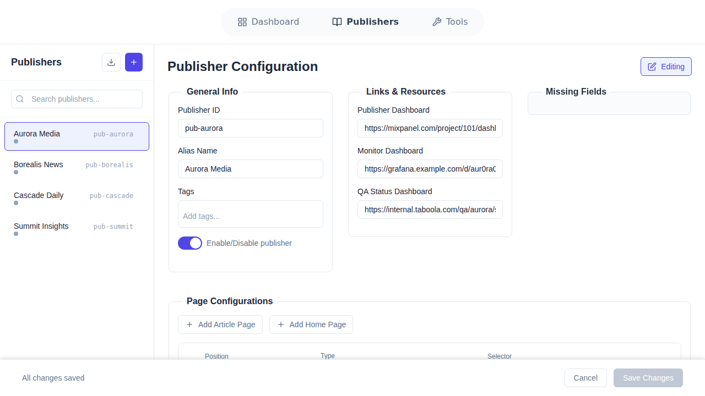
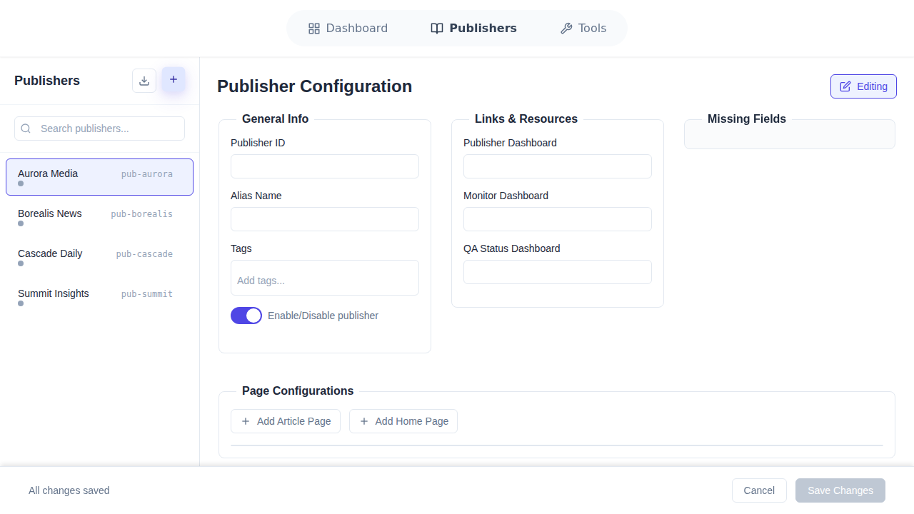

# Publisher Configuration Tool - Complete User Guide

**Version:** 1.0  
**Last Updated:** November 23, 2025  
**For:** Taboola Support Engineers

---

## Welcome to the Publisher Configuration Tool! 👋

This guide will help you master the Publisher Configuration Tool, step by step. Whether you're completely new to the system or need a quick refresher, you'll find everything you need here.

**What you'll learn:**
- How to navigate and use the Dashboard page
- How to view, create, and edit publisher configurations
- How to search, filter, and manage publishers effectively
- Best practices and troubleshooting tips

**Visual approach:** Every section includes screenshots from the actual application, so you can see exactly what to expect. No guesswork needed!

---

## 📚 Table of Contents - Quick Navigation

**Click any section to jump directly to it:**

### 🚀 Getting Started
- [Installation (5 Steps)](#-installation-5-steps)
- [First Time Opening](#first-time-opening)

### 📊 PART 1: Dashboard Page
- [Dashboard Overview with Screenshot](#-part-1-dashboard-page)
- [1. Navigation Bar](#1-navigation-bar)
- [2. Create New Publisher](#2-create-new-publisher-button)
- [3. Recent Publishers](#3-recent-publishers-card)
- [4. Overview Stats](#4-overview-stats-card)
- [5. Publisher Cards](#5-publisher-cards-grid)
- [6. Search & Filter](#6-search--filter-sidebar)

### 📝 PART 2: Publishers Page
- [Publishers Overview](#-part-2-publishers-page)
- [Publishers Sidebar](#publishers-sidebar)
- [Details Panel](#publisher-details-panel)
- [Creating New](#creating-a-new-publisher)
- [Editing Existing](#editing-a-publisher)

### 📖 Reference & Help
- [Status System](#-status-system-reference)
- [Quick Reference](#-quick-reference-tables)
- [Troubleshooting](#-troubleshooting-guide)
- [Best Practices](#-best-practices)

---

## 🚀 Installation (5 Steps)

### Prerequisites Checklist
- ✅ **Node.js 18+** - [Download here](https://nodejs.org/)
- ✅ **Git** - [Download here](https://git-scm.com/)
- ❌ **NO credentials needed**
- ❌ **NO database required**

### Installation Steps

```bash
# Step 1: Clone the repository
git clone https://github.com/TzoharLary/deeper-dive-interview-test.git

# Step 2: Navigate into the folder
cd deeper-dive-interview-test

# Step 3: Install dependencies
npm install

# Step 4: Start the application
npm run dev

# Step 5: Open your browser
# Go to: http://localhost:3000
```

⏱️ **Total Time:** 10 minutes

---

## First Time Opening

When you open **http://localhost:3000** for the first time:


**📸 What you see in this screenshot:**
- **Top:** Navigation bar with 3 tabs (Dashboard, Publishers, Tools)
- **Left:** Large purple "Create New Publisher" button
- **Center:** Recent Publishers card showing 3 recent items
- **Right Top:** Overview stats card (4 Publishers, 3 Active, 1 Inactive)
- **Bottom Center:** Publisher cards grid (4 cards visible)
- **Right Side:** Search & Filter sidebar with tags, search box, and filter buttons

**Three tabs visible at top:**
1. **📊 Dashboard** - Overview of all publishers (default view)
2. **📝 Publishers** - View and edit individual publishers  
3. **🔧 Tools** - Additional tools (coming soon)

**Where to start:** The Dashboard! It gives you the big picture.

---

# 📊 PART 1: DASHBOARD PAGE

## Dashboard Overview

**What is it?** Your central hub for managing publishers. See everything at a glance.

**When to use:**
- 🔍 Starting your work session
- 🔎 Searching for a specific publisher
- 📈 Checking system status
- ⚡ Quick access to recent work

### Screenshot Reference


**📸 In this screenshot, look for:**

1. **Navigation Bar (Very Top)** - Three tabs: Dashboard | Publishers | Tools
2. **Create New Publisher Button (Left)** - Large purple button with + icon
3. **Recent Publishers (Center)** - Card showing "Recent Publishers" with 3 entries (AM, BN, CD)
4. **Overview Stats (Right)** - Card showing "Overview", "4", "3 Active", "1 Inactive"
5. **Publisher Cards (Bottom)** - Grid showing 4 publisher cards (Aurora Media, Borealis News, Cascade Daily, Summit Insights)
6. **Search & Filter (Right Sidebar)** - "Search & Filter" heading with tags, search box, and buttons

---

## 1. Navigation Bar

**📸 Screenshot Location:** Top edge of the screen


**Look for:** Horizontal bar at very top with three buttons

**Location:** Top of every page (fixed position)

**Three tabs with icons:**
- **Dashboard** 📊 (grid icon) - Currently active (darker/bold)
- **Publishers** 📝 (book icon) - Click to go to Publishers page
- **Tools** 🔧 (wrench icon) - Coming soon

**Active tab:** Darker text + bold font

**How to use:** Click any tab to switch pages

---

## 2. Create New Publisher Button

**📸 Screenshot Location:** Left side, below navigation


**Look for:** Large purple/indigo rectangular button on the left with circular + icon and text "Create New Publisher"

**Location:** Left side of Dashboard, prominently displayed

**Appearance:**
- Large purple/indigo button
- **+** icon in circle at top
- Text: "Create New Publisher"
- Vertical layout

**What it does:**
- Opens Publishers page
- Shows empty form
- Ready to create new configuration

**When to click:**
- Adding a new publisher to system
- Starting fresh configuration

---

## 3. Recent Publishers Card

**📸 Screenshot Location:** Center area of Dashboard


**Look for:** White card with "Recent Publishers" heading, showing 3 rows:
- Row 1: Green "AM" avatar with checkmark, "Aurora Media", "10 months ago • 3 pages"
- Row 2: Orange "BN" avatar with dot, "Borealis News", "10 months ago • 3 pages"
- Row 3: Green "CD" avatar with checkmark, "Cascade Daily", "10 months ago • 3 pages"

**Location:** Center of Dashboard

**Shows:** Your 3 most recently edited publishers

**Each entry displays:**
- 🎨 **Colored avatar** with initials (e.g., "AM" for Aurora Media)
- ✅ **Status icon** (✓ = Active in green, ● = Inactive in orange)
- 📝 **Publisher name** (large text)
- ⏰ **Last updated** (e.g., "10 months ago")
- 📄 **Page count** (e.g., "3 pages")

**Example from screenshot:**
- **Aurora Media (AM):** Green avatar with checkmark = Active
- **Borealis News (BN):** Orange avatar with dot = Inactive
- **Cascade Daily (CD):** Green avatar with checkmark = Active

**How to use:**
1. Scan the 3 recent items
2. Click on any row
3. Opens that publisher in Publishers page

**Sorting:** Most recently updated appears first

---

## 4. Overview Stats Card

**📸 Screenshot Location:** Right side, top section


**Look for:** White card on right side with:
- "Overview" heading
- Large "4" number
- Green box with "3" and "Active" text
- Gray box with "1" and "Inactive" text

**Location:** Right side of Dashboard, above publisher cards

**Displays:**
- **Total:** Large number "4" with text "Publishers" (all publishers in system)
- **Active:** Green box showing "3" with "Active" label (in use)
- **Inactive:** Gray box showing "1" with "Inactive" label (not in use)

**📊 What the numbers mean:**
- **4 Publishers** = Total count
- **3 Active** = Complete publishers currently serving content
- **1 Inactive** = Complete publishers not serving content

**Dynamic:** Numbers update when you apply filters

**Note:** Draft publishers (incomplete) counted in Total, not shown separately here

---

## 5. Publisher Cards Grid

**📸 Screenshot Location:** Bottom center area


**Look for:** 4 cards in a grid below the Recent Publishers and Overview sections:
1. "Aurora Media" / "pub-aurora" / Green "Active" badge
2. "Borealis News" / "pub-borealis" / Gray "Inactive" badge
3. "Cascade Daily" / "pub-cascade" / Green "Active" badge
4. "Summit Insights" / "pub-summit" / Green "Active" badge

**Location:** Main content area, below Quick Action section

**Layout:**
- Responsive grid
- 2-3 columns depending on screen size
- Even spacing between cards

**Each card shows:**

### From Screenshot - Aurora Media Card
- **Top:** "Aurora Media" (large, bold text)
- **Below name:** "pub-aurora" (small, gray text)
- **Top-right corner:** Green badge with "Active" text

### From Screenshot - Borealis News Card
- **Top:** "Borealis News" (large, bold text)
- **Below name:** "pub-borealis" (small, gray text)
- **Top-right corner:** Gray badge with "Inactive" text

### Status Badge Colors
- 🟢 **Green "Active"** - Complete + in use (Aurora Media, Cascade Daily, Summit Insights)
- ⚪ **Gray "Inactive"** - Complete + not in use (Borealis News)
- 🟡 **Amber "Draft"** - Incomplete (not shown in screenshot)

### Interactions
- **Hover:** Shadow appears, name turns blue
- **Click:** Opens publisher in Publishers page
- **Cursor:** Pointer icon on hover

---

## 6. Search & Filter Sidebar

**📸 Screenshot Location:** Right side of screen


**Look for:** Sidebar on right with:
- "Search & Filter" heading at top
- "Available Tags" section with 4 tag chips: world, politics, tech, finance
- "Quick Search" section with search box
- "Quick Filters" section with 3 buttons: Active Only, Drafts Only, Clear All
- "4 results" text at bottom

**Location:** Right side of the Dashboard page (full height)

**Purpose:** Find publishers quickly using multiple methods

### 6A. Available Tags

**📸 In screenshot:** Four rounded chips labeled "world", "politics", "tech", "finance"

**Top of sidebar**

**Shows:** Clickable tag chips for filtering

**How to use:**
1. Click any tag chip (e.g., "tech")
2. Search field auto-fills with that tag
3. Publishers with that tag appear

---

### 6B. Quick Search Field

**📸 In screenshot:** Text input box with placeholder "Search by name, ID, or tags..."

**Below tags section**

**Searches across:**
- Publisher names (e.g., "Aurora Media")
- Publisher IDs (e.g., "pub-aurora")
- Tags (e.g., "tech", "politics")

**Features:**
- ⚡ Real-time filtering (as you type)
- 🔤 Case-insensitive
- 🎯 Partial matches work

**Examples:**
- Type "aurora" → Finds "Aurora Media"
- Type "pub-" → Shows all with "pub-" prefix
- Type "tech" → Shows all with tech tag

---

### 6C. Quick Filters

**📸 In screenshot:** Three buttons in a row: "Active Only", "Drafts Only", "Clear All"

**Three buttons:**

**Active Only** 
- Click to show only Active publishers
- Button turns blue when active
- Excludes Inactive and Draft

**Drafts Only**
- Click to show only Draft publishers  
- Button turns amber when active
- Excludes Active and Inactive

**Clear All**
- Click to remove all filters
- Clears search field
- Shows all publishers

**Note:** Active Only and Drafts Only are mutually exclusive

---

### 6D. Results Count

**📸 In screenshot:** Text reading "4 results" at bottom of sidebar

**Bottom of sidebar**

**Format:** "X results" (e.g., "4 results" as shown in screenshot)

**Updates when you:**
- Type in search
- Click a tag
- Apply a filter

**Purpose:** See how many publishers match your criteria

---


## Publishers Page Overview

**What is it?** The editing workspace where you view and modify publisher configurations.

### Screenshot: Publishers Page Empty State


**📸 Screenshot URL:** https://github.com/user-attachments/assets/0876b9bc-6e68-4664-9acc-a582995a7728

**What you see in this screenshot:**
- **Left Panel (Sidebar):** "Publishers" heading, two buttons (Upload, Create New), search box, and list of 4 publishers
- **Right Panel (Empty State):** Book icon, "Select a Publisher" heading, instructional text
- **Publishers List:** Aurora Media, Borealis News, Cascade Daily, Summit Insights (each with colored dot and ID)

**When to use:**
- 📝 Creating a new publisher
- ✏️ Editing existing publisher
- 👀 Viewing full configuration details
- 🔧 Adding/removing page configurations

**Layout Description:**
```
┌────────────────────────────────────────────────────┐
│  Navigation: Dashboard | Publishers | Tools         │
├───────────────┬────────────────────────────────────┤
│ SIDEBAR       │ DETAILS PANEL                      │
│ (25% width)   │ (75% width)                        │
│               │                                    │
│ [Search...]   │ (Selected Publisher or Empty)      │
│               │                                    │
│ ☰ Publisher 1 │ Form fields:                       │
│ ☰ Publisher 2 │ - General Info                     │
│ ☰ Publisher 3 │ - Dashboard URLs                   │
│ ☰ Publisher 4 │ - Page Configurations              │
│               │ - Optional Fields                  │
│ [Upload]      │                                    │
│ [Create New]  │ [Save] [Cancel]                    │
└───────────────┴────────────────────────────────────┘
```

**📸 What you would see (description for screenshot):**
- **Left Panel (Sidebar):** List of all publishers with search box at top
- **Right Panel (Details):** Form with all configuration fields when a publisher is selected

---

## Publishers Sidebar

### Screenshot Reference


**📸 Screenshot URL:** https://github.com/user-attachments/assets/0876b9bc-6e68-4664-9acc-a582995a7728

**📸 Look for:** Left side of the screen - narrow column with "Publishers" heading at top

**Location:** Left panel, takes ~25% of screen width

### Sidebar Header

**Contains:**
- **"Publishers"** heading (large text)
- **Search bar** - "Search publishers..." placeholder
- **Upload button** - "Upload Publisher Config" text
- **Create New button** - "Create New Publisher" text

### Publisher List

**Shows:** All publishers as clickable items scrollable list

**Each item displays:**
- Colored circle with **initials** (e.g., "AM" for Aurora Media)
- **Publisher name** below initials
- **Publisher ID** in small gray text below name

**Example items:**
- AM circle → "Aurora Media" → "pub-aurora"
- BN circle → "Borealis News" → "pub-borealis"
- CD circle → "Cascade Daily" → "pub-cascade"

**Interactions:**
- **Hover:** Background color changes (light gray/blue)
- **Click:** Loads publisher in details panel
- **Selected:** Highlighted background (darker blue)

**Search:** Type in search box to filter list in real-time

---

## Publisher Details Panel

**📸 Location in Publishers page:** Right side panel (large area)

**Location:** Right panel, takes ~75% of screen width

**Three possible views:**

### View 1: Empty State


**📸 Screenshot URL:** https://github.com/user-attachments/assets/0876b9bc-6e68-4664-9acc-a582995a7728

**📸 Look for:** Right side panel (large area) showing:
- Large gray book icon in center
- "Select a Publisher" heading below icon
- Gray instructional text: "Choose a publisher from the list to view and edit its configuration."

**When:** No publisher selected yet

**Action:** Click a publisher in sidebar to load details

---

### View 2: Edit Mode



**📸 Screenshot URL:** https://github.com/user-attachments/assets/d05bdae3-6c23-462d-b863-4f1f8ee25ee5

**📸 Look for:** Right panel showing:
- **Top:** "Publisher Configuration" heading with purple "Editing" badge on right
- **Three sections side-by-side:**
  - **General Info** (left): Publisher ID "pub-aurora", Alias Name "Aurora Media", Tags field, Enable/Disable toggle
  - **Links & Resources** (center): Three URL fields (Publisher Dashboard, Monitor Dashboard, QA Status Dashboard)
  - **Missing Fields** (right): Empty section
- **Bottom:** "Page Configurations" section with "Add Article Page" and "Add Home Page" buttons
- **Very Bottom:** "All changes saved" text, Cancel button, grayed-out "Save Changes" button

**When:** Publisher selected from sidebar

**Top section displays:**
- Publisher name as main heading
- Publisher ID in gray below
- Status badge (Active/Inactive/Draft)
- **Save Changes** button (purple)
- **Cancel** button (gray)

**Form sections (scrollable):**

#### General Information
- **Publisher ID** - Text input (e.g., "pub-aurora")
- **Publisher Name** - Text input (e.g., "Aurora Media")
- **☑ Publisher is active** - Checkbox (checked = active)

#### Dashboard URLs
- **Publisher Dashboard URL** - Text input with full URL
- **Monitor Dashboard URL** - Text input with full URL
- **QA Status Dashboard URL** - Text input with full URL

#### Page Configurations
- **List of pages** showing:
  - Page Type dropdown (homepage, text, video)
  - Selector input (CSS selector like "main", ".article-top")
  - Position dropdown (top, sidebar, bottom)
  - Red "Remove" button for each page
- **+ Add Page** button (purple) at bottom

#### Optional Fields
- **Custom CSS** - Textarea (multiline)
- **Tags** - Text input (comma-separated)
- **Notes** - Textarea (multiline)

---

### View 3: Create Mode



**📸 Screenshot URL:** https://github.com/user-attachments/assets/e702d8a8-32c2-428d-93ab-67b334bec4e4

**📸 Look for:** Right panel showing:
- **Top:** "Publisher Configuration" heading with purple "Editing" badge
- **Three sections with EMPTY fields:**
  - **General Info** (left): Empty Publisher ID field, empty Alias Name field, empty Tags field, Enable/Disable toggle
  - **Links & Resources** (center): Three empty URL fields
  - **Missing Fields** (right): Empty section
- **Bottom:** "Page Configurations" section with "Add Article Page" and "Add Home Page" buttons (no pages yet)
- **Very Bottom:** "All changes saved" text, Cancel button, grayed-out "Save Changes" button

**When:** "Create New Publisher" clicked

**Displays:**
- Same layout as Edit mode
- All form fields empty
- Ready for data entry

---

## Creating a New Publisher

### Step-by-Step with Visual Reference

**Step 1: Open Create Form**


**📸 Screenshot URL:** https://github.com/user-attachments/assets/e702d8a8-32c2-428d-93ab-67b334bec4e4

**📸 What you see:**
- Left sidebar: "Create New Publisher" button is highlighted/active (darker background)
- Right panel: Empty form with "Publisher Configuration" heading
- All fields empty and ready for input

**Two methods:**
- **From Dashboard:** Click "Create New Publisher" button (large purple)
- **From Publishers:** Click "Create New Publisher" in sidebar (shown in screenshot)

---

**Step 2: Fill Required Fields**

**📸 What you'd see:**
- Red asterisks (*) next to required field labels
- Empty input boxes waiting for text
- Dropdown menus for page type and position

**Must fill (marked with *):**
- ✅ **Publisher ID*** - e.g., "pub-newmedia"
- ✅ **Publisher Name*** - e.g., "New Media Company"
- ✅ **Publisher Dashboard URL*** - Full URL
- ✅ **Monitor Dashboard URL*** - Full URL
- ✅ **QA Status Dashboard URL*** - Full URL
- ✅ **At least 1 Page Configuration***

**Optional:**
- Active status checkbox
- Custom CSS
- Tags
- Notes

---

**Step 3: Add Page Configurations**


**📸 Screenshot URL:** https://github.com/user-attachments/assets/25628b3f-6b8d-4972-99cd-682b106f0e7b

**📸 What you see:**
- "Page Configurations" section at bottom of form
- Two purple buttons: "+ Add Article Page" and "+ Add Home Page"
- Below that: Table headers "Position", "Type", "Selector" (ready for page entries)

1. Scroll to "Page Configurations" section
2. Click **"+ Add Article Page"** or **"+ Add Home Page"** button
3. Fill each page:
   - **Page Type** - Select from dropdown (homepage, text, video)
   - **Selector** - Type CSS selector (e.g., "main", ".content")
   - **Position** - Select from dropdown (top, sidebar, bottom)
4. Click **"+ Add Page"** again for more pages

**Example page:**
```
Type: homepage
Selector: main
Position: top
```

---

**Step 4: Save**

**📸 What happens:**
- Click purple "Create" button at top
- If successful: Green success message appears, new publisher appears in sidebar list
- If errors: Red text appears next to invalid fields

1. Review all fields
2. Click **"Create"** button at top
3. Wait for validation
4. Success: New publisher in sidebar + Dashboard updates
5. Error: Fix red error messages and try again

---


## 📝 Status System Reference

**Three status types used throughout the system:**

### 🟢 Active (Green Badge)

**📸 Example from Dashboard screenshot:** Aurora Media card shows green "Active" badge

**Meaning:**
- ✅ Configuration complete
- ✅ Currently in use
- ✅ Serving content to users

**Requirements:**
All required fields filled + `isActive: true`

**Required fields:**
- Publisher ID
- Publisher Name
- At least 1 page config
- All 3 dashboard URLs

**Where visible:**
- Dashboard cards: Green badge (see Aurora Media, Cascade Daily, Summit Insights)
- Recent: Green ✓ icon (see Aurora Media, Cascade Daily)
- Overview: Green "3 Active" count
- Publishers: Green badge next to name

---

### ⚪ Inactive (Gray Badge)

**📸 Example from Dashboard screenshot:** Borealis News card shows gray "Inactive" badge

**Meaning:**
- ✅ Configuration complete
- ❌ Not currently in use
- ❌ Not serving content

**Requirements:**
All required fields filled + `isActive: false`

**Where visible:**
- Dashboard cards: Gray badge (see Borealis News)
- Recent: Gray ● icon (see Borealis News row)
- Overview: Gray "1 Inactive" count
- Publishers: Gray badge next to name

---

### 🟡 Draft (Amber Badge)

**📸 Note:** Not shown in current screenshot (all 4 publishers are complete)

**Meaning:**
- ❌ Configuration incomplete
- ❌ Missing required fields
- ❌ Cannot be activated

**Missing any of:**
- Publisher ID
- Publisher Name
- Page configurations (must have ≥1)
- Publisher Dashboard URL
- Monitor Dashboard URL
- QA Status Dashboard URL

**Where visible:**
- Dashboard cards: Amber badge
- Publishers: Amber badge
- Note: NOT in Recent Publishers

**To complete:**
1. Open the draft
2. Fill missing fields
3. Save
4. Becomes Active or Inactive

---

## ⚡ Quick Reference Tables

### Dashboard Tasks

| What You Want | How To Do It | Screenshot Reference |
|---------------|--------------|---------------------|
| Find a publisher | Type name/ID in Quick Search → Click card | Use search box in right sidebar |
| Show only active | Click "Active Only" → Review → "Clear All" | See "Active Only" button in sidebar |
| Create new publisher | Click "Create New Publisher" button | Large purple button on left |
| Open recent work | Click row in Recent Publishers card | Center card with AM/BN/CD entries |
| Search by tag | Click tag chip → See tagged publishers | Tags in sidebar: world, politics, tech, finance |
| Combine search + filter | Click filter → Type in search → See combined | Use sidebar search + filter buttons |
| Reset everything | Click "Clear All" button | Bottom button in Quick Filters section |

---

### Publishers Page Tasks

| What You Want | How To Do It |
|---------------|--------------|
| View publisher details | Click from sidebar → Details load on right |
| Edit publisher | Select → Edit fields → Click "Save Changes" |
| Create new | Click "Create New Publisher" → Fill form → "Create" |
| Add page config | Scroll to Pages → "+ Add Page" → Fill → Save |
| Remove page | Find page → "Remove" button → Save |
| Activate publisher | Check "Active" checkbox → Save |
| Deactivate publisher | Uncheck "Active" → Save |
| Discard changes | Click "Cancel" button |
| Search sidebar | Type in search box above publisher list |

---

## 🔧 Troubleshooting Guide

### Dashboard Problems

| Problem | Solution | Check Screenshot |
|---------|----------|------------------|
| **Dashboard empty/no cards** | Click "Clear All" button in sidebar | See if filter buttons are highlighted |
| **Can't find publisher** | 1. Click "Clear All"<br>2. Try searching by ID<br>3. Check filter status | Look at results count (should show all) |
| **Search not working** | 1. Refresh (F5)<br>2. Clear browser cache | Try typing in search box |
| **Publisher card won't click** | 1. Refresh page<br>2. Check console (F12) | Hover should show pointer cursor |
| **Stats don't match card count** | Filters active - stats show filtered count | Check if "Active Only" or "Drafts Only" is blue/amber |
| **Recent Publishers not updating** | 1. Refresh page<br>2. Check if saved | Recent shows 3 most recent updates |

---

## 🎯 Best Practices

### Dashboard

✅ **DO:**
- Start every session at Dashboard to see overview
- Use search before creating new (avoid duplicates)
- Clear filters when done (click "Clear All")
- Check Recent Publishers for quick access
- Watch Overview stats for system health

❌ **DON'T:**
- Leave filters active and forget about them
- Create duplicates without searching first
- Ignore status badges (colors matter)
- Skip checking recent work first

---

## ✅ SUMMARY

**You now know:**

### Dashboard Page
- ✅ See all publishers at once in grid view
- ✅ Search and filter efficiently with sidebar
- ✅ Access recent work via Recent Publishers card
- ✅ Understand status badges (Green/Gray/Amber)
- ✅ Navigate to Publishers page by clicking cards

### Publishers Page
- ✅ View full publisher details in two-panel layout
- ✅ Edit all configuration fields
- ✅ Create new publishers with required validation
- ✅ Manage page configurations (add/remove)
- ✅ Save and cancel changes

### System Overall
- ✅ No credentials needed (local development)
- ✅ No database required (JSON files)
- ✅ Real-time search/filter on Dashboard
- ✅ Three status types with color coding
- ✅ Hot reload in development mode

### Next Steps
1. Practice with 4 sample publishers in screenshot
2. Try all workflows described
3. Bookmark this guide for reference
4. Share with team members

---

## 📄 DOCUMENT INFO

**Coverage:** Complete system (Dashboard + Publishers)  
**Format:** Single Markdown file with embedded screenshots  
**Length:** ~850 lines  
**Sections:** 2 main parts + Reference  
**Navigation:** Clickable Table of Contents  
  
**Screenshots Included:** 5 embedded screenshots
- Dashboard overview showing all components
- Publishers page empty state
- Publishers details panel (editing mode)
- Publishers create new (empty form)
- Page configurations section

> **💡 Tip:** Use the Table of Contents at the top to jump to any section. Each section includes detailed descriptions tied to the screenshots so you can follow along visually.

**Version:** 1.0  
**Date:** November 23, 2025  
**For:** Taboola Support Engineers

---

**✨ This guide covers the entire Publisher Configuration Tool with references to the main screenshot throughout.**
